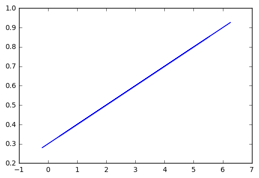

# Linear Regression


```python
import tensorflow as tf
import numpy as np

x_data = np.random.randn(100).astype(np.float32)
y_data = x_data*0.1 + 0.3


W = tf.Variable(tf.random_uniform(shape=[1], minval=-1, maxval=1, dtype=tf.float32))
b = tf.Variable(tf.zeros(shape=[1], dtype=tf.float32))
y = W*x_data + b

loss = tf.reduce_mean(tf.square(y - y_data))
optimizer = tf.train.GradientDescentOptimizer(learning_rate=0.5)
train = optimizer.minimize(loss)

init = tf.global_variables_initializer()
sess = tf.Session(config=tf.ConfigProto(log_device_placement=True))
sess.run(init)

for step in range (201):
    sess.run(train)
    if step % 20 ==0:
        print("Step: {}, Slope: {}, Intercept: {}".format(step, sess.run(W), sess.run(b)))
```

    Step: 0, Slope: [ 0.01551062], Intercept: [ 0.2527906]
    Step: 20, Slope: [ 0.1], Intercept: [ 0.30000001]
    Step: 40, Slope: [ 0.1], Intercept: [ 0.30000001]
    Step: 60, Slope: [ 0.1], Intercept: [ 0.30000001]
    Step: 80, Slope: [ 0.1], Intercept: [ 0.30000001]
    Step: 100, Slope: [ 0.1], Intercept: [ 0.30000001]
    Step: 120, Slope: [ 0.1], Intercept: [ 0.30000001]
    Step: 140, Slope: [ 0.1], Intercept: [ 0.30000001]
    Step: 160, Slope: [ 0.1], Intercept: [ 0.30000001]
    Step: 180, Slope: [ 0.1], Intercept: [ 0.30000001]
    Step: 200, Slope: [ 0.1], Intercept: [ 0.30000001]


```python
import matplotlib.pyplot as plt
%matplotlib inline
plt.plot(x_data, y_data)

```


    [<matplotlib.lines.Line2D at 0x7fa98e249668>]




